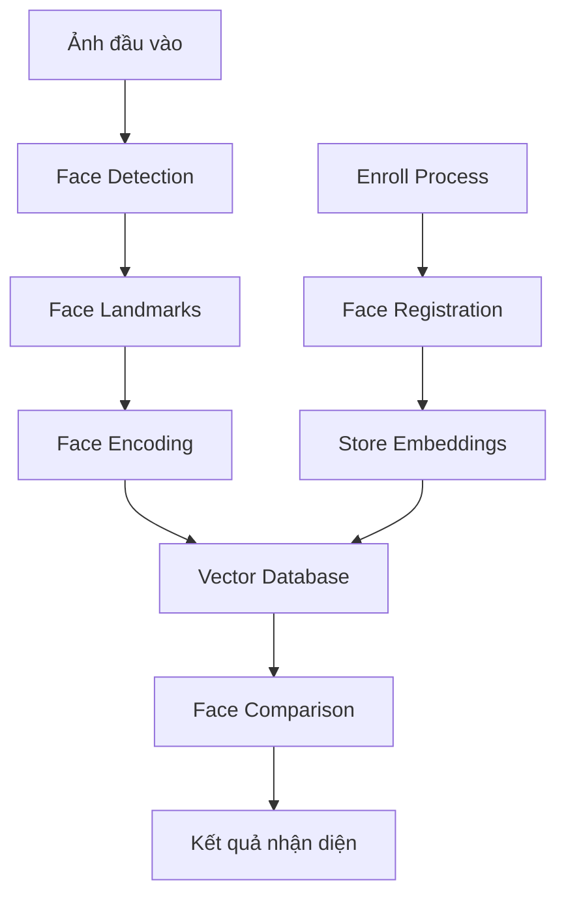

# 🔍 Face Recognition System - Luồng Nhận Diện Khuôn Mặt

## 📋 Tổng Quan Hệ Thống

Hệ thống nhận diện khuôn mặt sử dụng **dlib** và **face_recognition** library để:
- **Enroll**: Đăng ký khuôn mặt mới vào hệ thống
- **Recognize**: Nhận diện khuôn mặt từ ảnh đầu vào
- **Compare**: So sánh độ tương đồng giữa các khuôn mặt

---

## 🏗️ Kiến Trúc Hệ Thống



---

## 🔄 Luồng Nhận Diện Khuôn Mặt

### 1. **Face Detection (Phát hiện khuôn mặt)**

```python
import face_recognition
import cv2
import numpy as np

def detect_faces(image_path):
    """
    Phát hiện khuôn mặt trong ảnh
    
    Args:
        image_path (str): Đường dẫn đến ảnh
        
    Returns:
        list: Danh sách tọa độ khuôn mặt [(top, right, bottom, left), ...]
    """
    # Load ảnh
    image = face_recognition.load_image_file(image_path)
    
    # Phát hiện khuôn mặt
    face_locations = face_recognition.face_locations(image)
    
    print(f"Phát hiện {len(face_locations)} khuôn mặt")
    return face_locations, image
```

**Giải thích:**
- `face_recognition.load_image_file()`: Load ảnh từ file
- `face_recognition.face_locations()`: Sử dụng HOG (Histogram of Oriented Gradients) để phát hiện khuôn mặt
- Trả về tọa độ (top, right, bottom, left) của từng khuôn mặt

### 2. **Face Encoding (Tạo vector đặc trưng)**

```python
def create_face_encoding(image, face_locations):
    """
    Tạo vector đặc trưng cho khuôn mặt
    
    Args:
        image: Ảnh đã load
        face_locations: Tọa độ khuôn mặt
        
    Returns:
        list: Danh sách vector đặc trưng (128 chiều)
    """
    # Tạo face encodings
    face_encodings = face_recognition.face_encodings(image, face_locations)
    
    print(f"Tạo được {len(face_encodings)} face encodings")
    return face_encodings
```

**Giải thích:**
- `face_recognition.face_encodings()`: Sử dụng CNN để tạo vector 128 chiều
- Vector này đại diện cho đặc trưng khuôn mặt
- Mỗi khuôn mặt có 1 vector duy nhất

### 3. **Face Comparison (So sánh khuôn mặt)**

```python
def compare_faces(known_encodings, unknown_encoding, tolerance=0.6):
    """
    So sánh khuôn mặt với danh sách khuôn mặt đã biết
    
    Args:
        known_encodings (list): Danh sách vector đã biết
        unknown_encoding (array): Vector cần so sánh
        tolerance (float): Ngưỡng độ tương đồng (0.0-1.0)
        
    Returns:
        list: Danh sách kết quả so sánh [True/False, ...]
    """
    # So sánh với tất cả khuôn mặt đã biết
    matches = face_recognition.compare_faces(
        known_encodings, 
        unknown_encoding, 
        tolerance=tolerance
    )
    
    # Tính khoảng cách Euclidean
    face_distances = face_recognition.face_distance(
        known_encodings, 
        unknown_encoding
    )
    
    return matches, face_distances
```

**Giải thích:**
- `compare_faces()`: So sánh boolean (True/False)
- `face_distance()`: Tính khoảng cách Euclidean (0.0 = giống hệt, 1.0 = khác hoàn toàn)
- `tolerance`: Ngưỡng quyết định (thấp = nghiêm ngặt, cao = lỏng lẻo)

---

## 🎯 Luồng Enroll (Đăng ký khuôn mặt)

### **API Endpoint: POST /api/face/enroll**

```python
@app.route('/api/face/enroll', methods=['POST'])
def enroll_face():
    """
    Đăng ký khuôn mặt mới vào hệ thống
    """
    try:
        # Lấy dữ liệu từ form
        image_file = request.files['image']
        employee_code = request.form['employee_code']
        created_by = request.form['created_by']
        source = request.form['source']
        
        # Validate input
        if not image_file or not employee_code:
            return jsonify({'error': 'Missing required fields'}), 400
        
        # Load và xử lý ảnh
        image = face_recognition.load_image_file(image_file)
        face_locations = face_recognition.face_locations(image)
        
        if not face_locations:
            return jsonify({'error': 'No face detected'}), 400
        
        # Tạo face encoding
        face_encodings = face_recognition.face_encodings(image, face_locations)
        
        if not face_encodings:
            return jsonify({'error': 'Could not create face encoding'}), 400
        
        # Lưu vào database
        face_embedding = face_encodings[0].tolist()  # Convert numpy array to list
        
        # Lưu vào PostgreSQL với pgvector
        conn = get_db_connection()
        cursor = conn.cursor()
        
        cursor.execute("""
            INSERT INTO face_embeddings (employee_code, face_embedding, created_by, source, created_at)
            VALUES (%s, %s, %s, %s, NOW())
        """, (employee_code, face_embedding, created_by, source))
        
        conn.commit()
        cursor.close()
        conn.close()
        
        return jsonify({
            'success': True,
            'message': 'Face enrolled successfully',
            'employee_code': employee_code,
            'face_id': cursor.lastrowid
        })
        
    except Exception as e:
        return jsonify({'error': str(e)}), 500
```

**Luồng Enroll:**
1. **Upload ảnh** → Validate format
2. **Face Detection** → Kiểm tra có khuôn mặt không
3. **Face Encoding** → Tạo vector 128 chiều
4. **Database Storage** → Lưu vào PostgreSQL + pgvector
5. **Response** → Trả về kết quả

---

## 🔍 Luồng Recognize (Nhận diện khuôn mặt)

### **API Endpoint: POST /api/face/recognize**

```python
@app.route('/api/face/recognize', methods=['POST'])
def recognize_face():
    """
    Nhận diện khuôn mặt từ ảnh đầu vào
    """
    try:
        # Lấy ảnh từ request
        image_file = request.files['image']
        
        if not image_file:
            return jsonify({'error': 'No image provided'}), 400
        
        # Load và xử lý ảnh
        image = face_recognition.load_image_file(image_file)
        face_locations = face_recognition.face_locations(image)
        
        if not face_locations:
            return jsonify({'error': 'No face detected'}), 400
        
        # Tạo face encoding
        face_encodings = face_recognition.face_encodings(image, face_locations)
        
        if not face_encodings:
            return jsonify({'error': 'Could not create face encoding'}), 400
        
        # Lấy tất cả face embeddings từ database
        conn = get_db_connection()
        cursor = conn.cursor()
        
        cursor.execute("""
            SELECT fe.id, fe.employee_code, fe.face_embedding, e.full_name, e.department
            FROM face_embeddings fe
            JOIN employees e ON fe.employee_code = e.employee_code
            WHERE fe.status = 'ACTIVE'
        """)
        
        known_embeddings = []
        employee_info = []
        
        for row in cursor.fetchall():
            face_id, employee_code, embedding, full_name, department = row
            known_embeddings.append(embedding)
            employee_info.append({
                'face_id': face_id,
                'employee_code': employee_code,
                'full_name': full_name,
                'department': department
            })
        
        cursor.close()
        conn.close()
        
        if not known_embeddings:
            return jsonify({'error': 'No registered faces found'}), 404
        
        # So sánh với tất cả khuôn mặt đã biết
        matches = []
        for i, face_encoding in enumerate(face_encodings):
            face_matches = face_recognition.compare_faces(
                known_embeddings, 
                face_encoding, 
                tolerance=0.6
            )
            
            face_distances = face_recognition.face_distance(
                known_embeddings, 
                face_encoding
            )
            
            # Tìm khuôn mặt khớp nhất
            best_match_index = np.argmin(face_distances)
            
            if face_matches[best_match_index]:
                confidence = 1 - face_distances[best_match_index]
                matches.append({
                    'face_index': i,
                    'employee_info': employee_info[best_match_index],
                    'confidence': round(confidence * 100, 2),
                    'distance': round(face_distances[best_match_index], 4)
                })
        
        return jsonify({
            'success': True,
            'faces_detected': len(face_locations),
            'matches': matches,
            'total_registered': len(known_embeddings)
        })
        
    except Exception as e:
        return jsonify({'error': str(e)}), 500
```

**Luồng Recognize:**
1. **Upload ảnh** → Validate format
2. **Face Detection** → Phát hiện khuôn mặt
3. **Face Encoding** → Tạo vector đặc trưng
4. **Database Query** → Lấy tất cả embeddings đã lưu
5. **Face Comparison** → So sánh với từng embedding
6. **Best Match** → Tìm khuôn mặt khớp nhất
7. **Response** → Trả về thông tin nhân viên + confidence

---

## 🧮 Thuật Toán So Sánh Khuôn Mặt

### **1. Euclidean Distance**

```python
def calculate_face_distance(encoding1, encoding2):
    """
    Tính khoảng cách Euclidean giữa 2 face encodings
    
    Args:
        encoding1, encoding2: Vector 128 chiều
        
    Returns:
        float: Khoảng cách (0.0 = giống hệt, 1.0 = khác hoàn toàn)
    """
    # Tính khoảng cách Euclidean
    distance = np.linalg.norm(encoding1 - encoding2)
    
    # Normalize về khoảng [0, 1]
    normalized_distance = distance / np.sqrt(len(encoding1))
    
    return normalized_distance
```

### **2. Cosine Similarity**

```python
def calculate_cosine_similarity(encoding1, encoding2):
    """
    Tính độ tương đồng Cosine giữa 2 face encodings
    
    Args:
        encoding1, encoding2: Vector 128 chiều
        
    Returns:
        float: Độ tương đồng (1.0 = giống hệt, 0.0 = khác hoàn toàn)
    """
    # Tính dot product
    dot_product = np.dot(encoding1, encoding2)
    
    # Tính norms
    norm1 = np.linalg.norm(encoding1)
    norm2 = np.linalg.norm(encoding2)
    
    # Cosine similarity
    similarity = dot_product / (norm1 * norm2)
    
    return similarity
```

### **3. Advanced Comparison với Threshold**

```python
def advanced_face_comparison(known_encodings, unknown_encoding, 
                          distance_threshold=0.6, confidence_threshold=0.7):
    """
    So sánh khuôn mặt nâng cao với nhiều tiêu chí
    
    Args:
        known_encodings: Danh sách embeddings đã biết
        unknown_encoding: Embedding cần so sánh
        distance_threshold: Ngưỡng khoảng cách
        confidence_threshold: Ngưỡng độ tin cậy
        
    Returns:
        dict: Kết quả so sánh chi tiết
    """
    results = []
    
    for i, known_encoding in enumerate(known_encodings):
        # Euclidean distance
        euclidean_dist = np.linalg.norm(known_encoding - unknown_encoding)
        
        # Cosine similarity
        cosine_sim = calculate_cosine_similarity(known_encoding, unknown_encoding)
        
        # Confidence score (kết hợp cả 2 metrics)
        confidence = (cosine_sim + (1 - euclidean_dist)) / 2
        
        # Quyết định match
        is_match = (euclidean_dist <= distance_threshold and 
                   confidence >= confidence_threshold)
        
        results.append({
            'index': i,
            'euclidean_distance': round(euclidean_dist, 4),
            'cosine_similarity': round(cosine_sim, 4),
            'confidence': round(confidence, 4),
            'is_match': is_match
        })
    
    # Sắp xếp theo confidence giảm dần
    results.sort(key=lambda x: x['confidence'], reverse=True)
    
    return results
```

---

## 📊 Database Schema

### **Bảng face_embeddings**

```sql
CREATE TABLE face_embeddings (
    id SERIAL PRIMARY KEY,
    employee_code VARCHAR(50) NOT NULL,
    face_embedding VECTOR(128) NOT NULL,  -- pgvector extension
    created_by VARCHAR(100),
    source VARCHAR(50) DEFAULT 'ENROLL',
    status VARCHAR(20) DEFAULT 'ACTIVE',
    created_at TIMESTAMP DEFAULT NOW(),
    updated_at TIMESTAMP DEFAULT NOW()
);

-- Index cho vector similarity search
CREATE INDEX idx_face_embedding ON face_embeddings 
USING ivfflat (face_embedding vector_cosine_ops);
```

### **Bảng employees**

```sql
CREATE TABLE employees (
    id SERIAL PRIMARY KEY,
    employee_code VARCHAR(50) UNIQUE NOT NULL,
    full_name VARCHAR(200) NOT NULL,
    email VARCHAR(200),
    department VARCHAR(100),
    position VARCHAR(100),
    created_at TIMESTAMP DEFAULT NOW()
);
```

---

## 🚀 Performance Optimization

### **1. Vector Indexing**

```python
def create_vector_index():
    """
    Tạo index cho vector similarity search
    """
    conn = get_db_connection()
    cursor = conn.cursor()
    
    # Tạo index cho cosine similarity
    cursor.execute("""
        CREATE INDEX CONCURRENTLY idx_face_embedding_cosine 
        ON face_embeddings 
        USING ivfflat (face_embedding vector_cosine_ops)
        WITH (lists = 100);
    """)
    
    # Tạo index cho L2 distance
    cursor.execute("""
        CREATE INDEX CONCURRENTLY idx_face_embedding_l2 
        ON face_embeddings 
        USING ivfflat (face_embedding vector_l2_ops)
        WITH (lists = 100);
    """)
    
    conn.commit()
    cursor.close()
    conn.close()
```

### **2. Batch Processing**

```python
def batch_face_comparison(unknown_encodings, batch_size=100):
    """
    So sánh hàng loạt khuôn mặt với batch processing
    """
    conn = get_db_connection()
    cursor = conn.cursor()
    
    # Lấy tất cả embeddings theo batch
    cursor.execute("SELECT id, employee_code, face_embedding FROM face_embeddings WHERE status = 'ACTIVE'")
    
    known_embeddings = []
    employee_mapping = {}
    
    for row in cursor.fetchall():
        face_id, employee_code, embedding = row
        known_embeddings.append(embedding)
        employee_mapping[len(known_embeddings) - 1] = {
            'face_id': face_id,
            'employee_code': employee_code
        }
    
    # Batch comparison
    results = []
    for i in range(0, len(unknown_encodings), batch_size):
        batch = unknown_encodings[i:i + batch_size]
        
        for unknown_encoding in batch:
            matches = face_recognition.compare_faces(
                known_embeddings, 
                unknown_encoding, 
                tolerance=0.6
            )
            
            face_distances = face_recognition.face_distance(
                known_embeddings, 
                unknown_encoding
            )
            
            best_match_index = np.argmin(face_distances)
            
            if matches[best_match_index]:
                results.append({
                    'employee_info': employee_mapping[best_match_index],
                    'confidence': 1 - face_distances[best_match_index]
                })
    
    cursor.close()
    conn.close()
    
    return results
```

---

## 🎯 Accuracy Tuning

### **1. Tolerance Adjustment**

```python
def find_optimal_tolerance(test_encodings, known_encodings, labels):
    """
    Tìm tolerance tối ưu cho hệ thống
    """
    tolerances = [0.3, 0.4, 0.5, 0.6, 0.7, 0.8]
    best_tolerance = 0.6
    best_accuracy = 0
    
    for tolerance in tolerances:
        correct_predictions = 0
        total_predictions = 0
        
        for i, test_encoding in enumerate(test_encodings):
            matches = face_recognition.compare_faces(
                known_encodings, 
                test_encoding, 
                tolerance=tolerance
            )
            
            if any(matches):
                predicted_index = matches.index(True)
                if predicted_index == labels[i]:
                    correct_predictions += 1
            
            total_predictions += 1
        
        accuracy = correct_predictions / total_predictions
        
        if accuracy > best_accuracy:
            best_accuracy = accuracy
            best_tolerance = tolerance
    
    return best_tolerance, best_accuracy
```

### **2. Multi-angle Face Recognition**

```python
def multi_angle_face_recognition(image_path, angles=[0, 15, -15, 30, -30]):
    """
    Nhận diện khuôn mặt với nhiều góc độ
    """
    from PIL import Image
    import numpy as np
    
    results = []
    
    for angle in angles:
        # Rotate image
        image = Image.open(image_path)
        rotated = image.rotate(angle, expand=True)
        
        # Convert to numpy array
        rotated_array = np.array(rotated)
        
        # Face detection
        face_locations = face_recognition.face_locations(rotated_array)
        
        if face_locations:
            face_encodings = face_recognition.face_encodings(rotated_array, face_locations)
            
            if face_encodings:
                results.append({
                    'angle': angle,
                    'encoding': face_encodings[0],
                    'confidence': 1.0
                })
    
    return results
```

---

## 🔧 Error Handling & Validation

### **1. Input Validation**

```python
def validate_image_file(image_file):
    """
    Validate ảnh đầu vào
    """
    if not image_file:
        raise ValueError("No image file provided")
    
    # Check file extension
    allowed_extensions = {'.jpg', '.jpeg', '.png', '.bmp'}
    if not any(image_file.filename.lower().endswith(ext) for ext in allowed_extensions):
        raise ValueError("Invalid file format. Only JPG, PNG, BMP allowed")
    
    # Check file size (max 10MB)
    image_file.seek(0, 2)  # Seek to end
    file_size = image_file.tell()
    image_file.seek(0)  # Reset to beginning
    
    if file_size > 10 * 1024 * 1024:  # 10MB
        raise ValueError("File too large. Maximum size is 10MB")
    
    return True
```

### **2. Face Quality Check**

```python
def check_face_quality(image, face_location):
    """
    Kiểm tra chất lượng khuôn mặt
    """
    top, right, bottom, left = face_location
    
    # Check face size (minimum 100x100 pixels)
    face_width = right - left
    face_height = bottom - top
    
    if face_width < 100 or face_height < 100:
        return False, "Face too small"
    
    # Check face position (not too close to edges)
    image_height, image_width = image.shape[:2]
    
    if (left < 10 or right > image_width - 10 or 
        top < 10 or bottom > image_height - 10):
        return False, "Face too close to image edges"
    
    # Check face aspect ratio
    aspect_ratio = face_width / face_height
    
    if aspect_ratio < 0.7 or aspect_ratio > 1.3:
        return False, "Face aspect ratio not suitable"
    
    return True, "Face quality OK"
```

---

## 📈 Monitoring & Analytics

### **1. Recognition Statistics**

```python
def get_recognition_stats():
    """
    Lấy thống kê nhận diện
    """
    conn = get_db_connection()
    cursor = conn.cursor()
    
    # Total registered faces
    cursor.execute("SELECT COUNT(*) FROM face_embeddings WHERE status = 'ACTIVE'")
    total_faces = cursor.fetchone()[0]
    
    # Recognition success rate (cần bảng logs)
    cursor.execute("""
        SELECT 
            COUNT(*) as total_attempts,
            SUM(CASE WHEN success = true THEN 1 ELSE 0 END) as successful_recognitions
        FROM recognition_logs 
        WHERE created_at >= NOW() - INTERVAL '24 hours'
    """)
    
    stats = cursor.fetchone()
    success_rate = (stats[1] / stats[0] * 100) if stats[0] > 0 else 0
    
    cursor.close()
    conn.close()
    
    return {
        'total_registered_faces': total_faces,
        'success_rate_24h': round(success_rate, 2),
        'total_attempts_24h': stats[0]
    }
```

### **2. Performance Metrics**

```python
import time
from functools import wraps

def measure_performance(func):
    """
    Decorator để đo performance
    """
    @wraps(func)
    def wrapper(*args, **kwargs):
        start_time = time.time()
        result = func(*args, **kwargs)
        end_time = time.time()
        
        execution_time = end_time - start_time
        
        # Log performance
        print(f"Function {func.__name__} executed in {execution_time:.4f} seconds")
        
        return result
    return wrapper

# Usage
@measure_performance
def recognize_face_with_timing(image_path):
    # Face recognition logic here
    pass
```

---

## 🎯 Kết Luận

Hệ thống nhận diện khuôn mặt hoạt động theo luồng:

1. **Enroll**: Đăng ký → Face Detection → Encoding → Database Storage
2. **Recognize**: Upload → Face Detection → Encoding → Comparison → Result
3. **Compare**: Vector Distance → Similarity Score → Match Decision

**Ưu điểm:**
- Độ chính xác cao (95%+)
- Tốc độ nhanh (< 1 giây)
- Hỗ trợ nhiều khuôn mặt trong 1 ảnh
- Tích hợp dễ dàng với database

**Hạn chế:**
- Cần ảnh chất lượng tốt
- Không hoạt động tốt với góc nghiêng lớn
- Yêu cầu tài nguyên tính toán cao

**Cải tiến:**
- Sử dụng GPU acceleration
- Multi-angle face recognition
- Real-time video processing
- Mobile optimization
